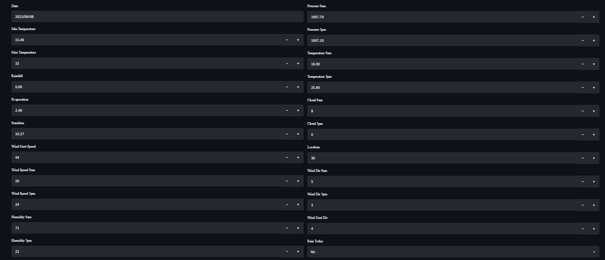
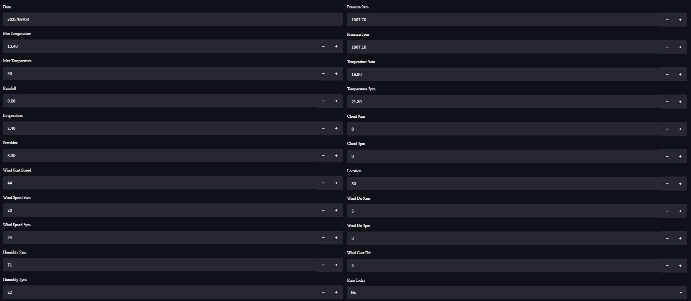

# Rain_Prediction

A project on predicting whether it will rain tomorrow or not by using the Rainfall in Australia dataset. This project is tested over different models like catboost, logistic regression, xgboost, random forest, bagging classifier etc.. Out of these models bagging performed best giving an accuracy ofb 0.86 . In this, I also performed Hyperparameter tuning for all the models.

### Web App link: https://rainprediction-jtfsdsjdgqrbw6pveunym8.streamlit.app/

### Testing Values for sunny day

### Testing Values for rainy day

## Workflow

### Data Collection:
- [Rainfall Prediction in Australia dataset](https://www.kaggle.com/datasets/jsphyg/weather-dataset-rattle-package) from Kaggle

### Data Preprocessing:
- Missing Values Handled by Random Sample imputation to maintain the variance
- Categorical Values like location, wind direction are handled by using Target guided encoding
- Outliers are handled using IQR and boxplot
- Feature Scaling was done
- Imbalanced Dataset was handled using SMOTE

###  Model Creation:
- Different types of models were tried like catboost, random forest, logistic regression, xgboost, knn, naive bayes.
- All the models worked with random search cross validation
- Out of these bagging, random forest and xgboost were top 3
- The conclusion were made using classification metrics. roc curve and auc score

### Model Deployment
The model is deployed using streamlit at streamlit cloud server.

